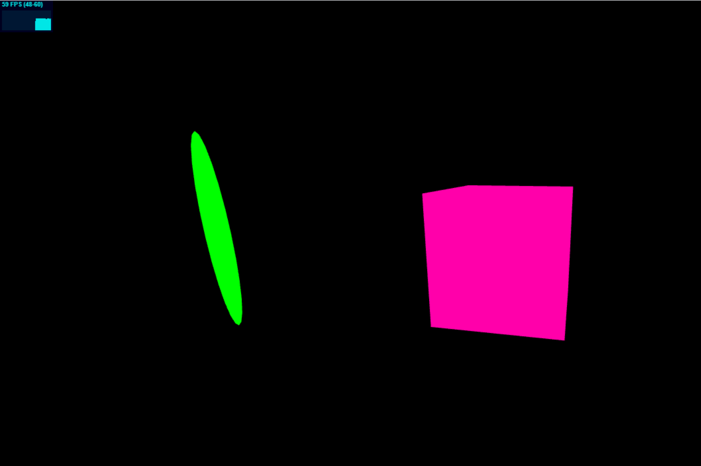

# 3dSite #
**A short website with tree.js Frameworks**  
This is the basic setup. 
  
This is reedmee contain somes informations to remember.
***


## import THREE.JS ##
To use three.js we must import the framework. We can use a cdn but it can be painlesss if you don't understand the framework and less performing. 
I advise you to download it [here](https://github.com/mrdoob/three.js/archive/master.zip).

To begin use 3 files :

1. **three.module.js** in *"/three.js-master/build"* (all three.js fonctions)
2. **OrbitControls.js** in  *"/three.js-master/examples/jsm/controls"* (to moove around in the renderer)
3. **stats.module.js** in *"/three.js-master/examples/jsm/libs"* (To know all the stat you need to create a perform website);

then place these in a folder call **"lib"**, the name doesn't matter.
create a main.js file at root and import you're lib folder
```js
import * as THREE from "./lib/three.module.js";
import {OrbitControls} from "./lib/OrbitControls.js";
import Stats from "./lib/stats.module.js";
```

then create a HTML FILE named index.html and import main.js
```HTML
<script type="module" src="main.js"></script>
```
### Create the scene ### 

The best usage is to create a fonction init to place it in a class.
    
1. Create a camera with 4 params
2. Create the renderer 
 ```js
export default class Main {

    constructor(){
        this.init();
    }
    init(){

        this.scene =  new THREE.Scene();
        // 4 param -> lenght of the focale, ratio of the scene (here the size of the window), the clayping (what will be calculated in the scene)
        this.camera = new THREE.PerspectiveCamera(75, window.innerWidth / window.innerHeight, .1, 1000);

        this.renderer = new THREE.WebGLRenderer({antialias:true} /*{alpha:true}*/);
        this.renderer.setSize(window.innerWidth, window.innerHeight);
        
        //we placed the camera 
        this.camera.position.z = 2;
    }
}
 new Main();

  ```

All the scene will render in a canvas tag, if it's not create three.js will automaticaly create one for you.


### Create a object ###
 ```js
// for sphere
this.sphereGeometry = new THREE.SphereGeometry(1,12,12);
// for box
this.boxGeometry = new THREE.BoxGeometry(1,12,12);
```
###Assign material ####
You can use MeshBasicMaterial to assign a color
 ```js
const materialColor = new THREE.MeshBasicMaterial({color: 0xff00aa});
```

There are 3 differents parameters for all object :

* Position
```js
//All 3 axes
this.yourMesh.scale.set(1,1,1);
//Only x axes
this.yourMesh.position.x = -3;
```
* Rotation
```js
// rotation is in radian
//All 3 axes
this.yourMesh.rotation.set(-25,80,260);
//Only Y axes
this.yourMesh.rotation.y = 25 ;
```
* Scale
```js
//All 3 axes
this.yourMesh.scale.set(.1,1,.1);
//Only Z axes
this.yourMesh.scale.z = Math.PI / 4 ;
```


***
### long story short ###
The final code setUp :
```js
import * as THREE from "./lib/three.module.js";
import {OrbitControls} from "./lib/OrbitControls.js";
import Stats from "./lib/stats.module.js";


export default class Main {

    constructor(){

        this.update = this.update.bind(this);
        this.onResize = this.update.bind(this);
        // this method allows to use the functions of the scopes here.

        this.scene;
        this.camera;
        this.renderer;

        this.init();
    
    }

    init(){

        this.scene =  new THREE.Scene();
        this.camera = new THREE.PerspectiveCamera(75, window.innerWidth / window.innerHeight, .1, 1000);
        // 4 param -> lenght of the focale, ratio of the scene (here the size of the window), the clayping (what will be calculated in the scene)

        this.renderer = new THREE.WebGLRenderer({antialias:true} /*{alpha:true}*/);
        this.renderer.setSize(window.innerWidth, window.innerHeight);
        // si le canvas n'est pas spécifié il sera crée automatiquement

        this.camera.position.z = 2;
        
        window.addEventListener('resize', this.onResize, false);
        document.body.appendChild(this.renderer.domElement);

        this.Stats= new Stats();
        document.body.appendChild(this.Stats.dom);

        this.OrbitControls= new OrbitControls(this.camera, this.renderer.domElement);


        this.update();
        this.initObject();
    }

    initObject(){

        this.boxGeometry = new THREE.BoxGeometry(1,1,1);
        const materialColor = new THREE.MeshBasicMaterial({color: 0xff00aa});

        this.sphereGeometry = new THREE.SphereGeometry(1,12,12);
        const materialColorGreen = new THREE.MeshBasicMaterial({color: 0x00ff00});

        this.boxMesh = new THREE.Mesh(this.boxGeometry, materialColor);
        this.sphereMesh = new THREE.Mesh(this.sphereGeometry,materialColorGreen);

        this.sphereMesh.position.x = -3;
        this.sphereMesh.scale.set(.1,1,.1);
        this.scene.add(this.boxMesh, this.sphereMesh);
    }

    onResize(){

        const width = window.innerWidth;
        const height = window.innerHeight;

        this.camera.aspect = width / height;
        this.camera.updateProjectionMatrix();
        this.renderer.setSize(width, height);

    }


    update(){
        console.log("update");
        requestAnimationFrame(this.update);
        // this.cube.rotation.y += 0.01;

        this.renderer.render(this.scene, this.camera);
        this.Stats.update();

    }


}
new Main();


```
With this setup you will have 2 objects with different material, where you can navigate with orbital control and the size of the canvas is responsive.



Right now it is not very impressive, but it is a good start.

***