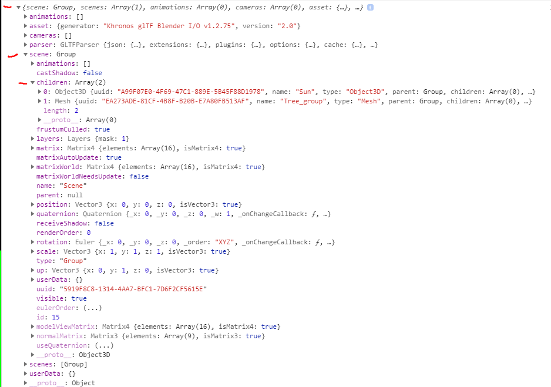
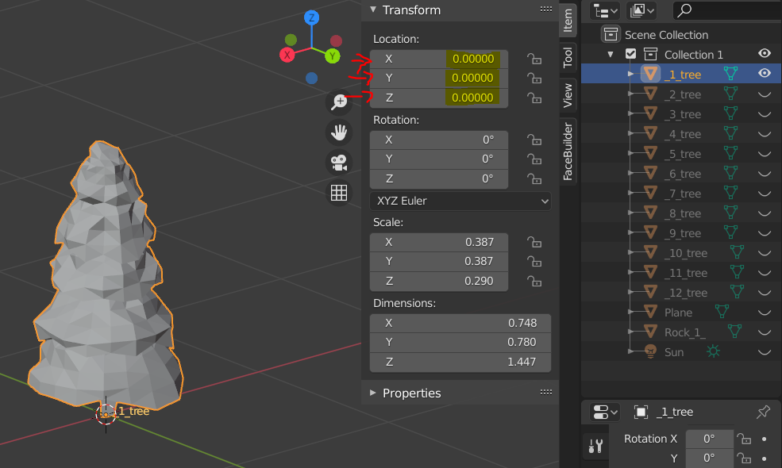
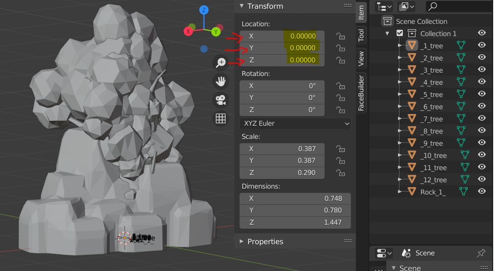
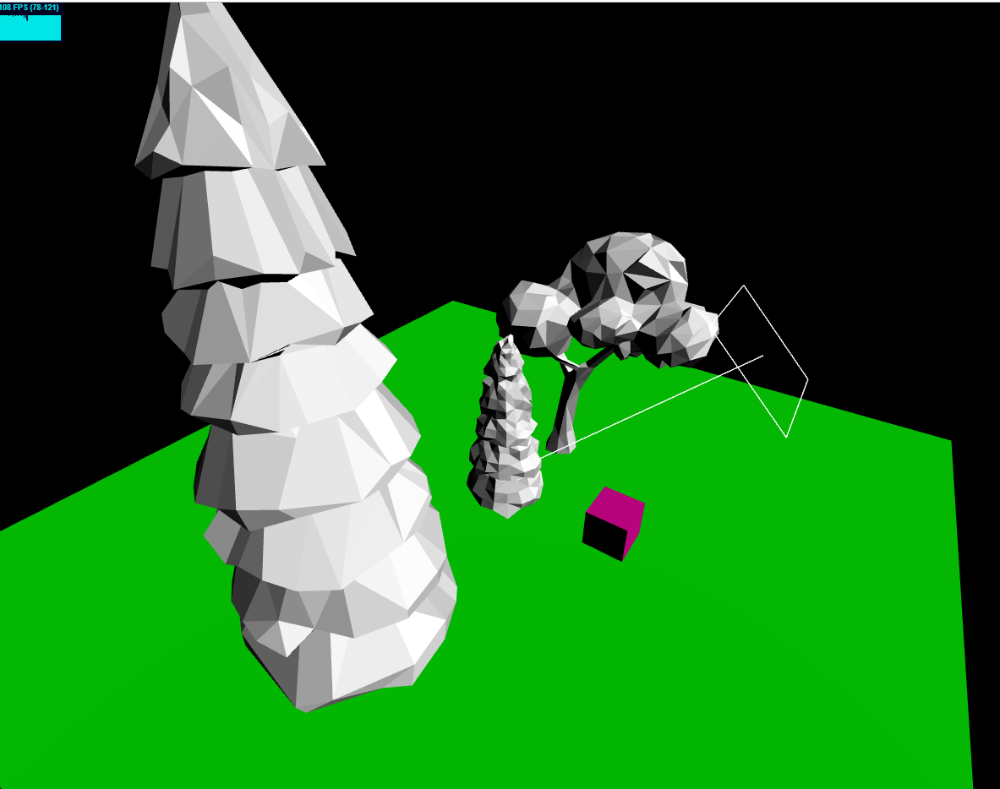

# 3dSite #
**A short website with tree.js Frameworks**  
This is the basic setup. 
  
This is reedmee contain somes informations to remember.
***


## import THREE.JS ##
To use three.js we must import the framework. We can use a cdn but it can be painlesss if you don't understand the framework and less performing. 
I advise you to download it [here](https://github.com/mrdoob/three.js/archive/master.zip).

To begin use 3 files :

1. **three.module.js** in *"/three.js-master/build"* (all three.js fonctions)
2. **OrbitControls.js** in  *"/three.js-master/examples/jsm/controls"* (to moove around in the renderer)
3. **stats.module.js** in *"/three.js-master/examples/jsm/libs"* (To know all the stat you need to create a perform website);

then place these in a folder call **"lib"**, the name doesn't matter.
create a main.js file at root and import you're lib folder
```js
import * as THREE from "./lib/three.module.js";
import {OrbitControls} from "./lib/OrbitControls.js";
import Stats from "./lib/stats.module.js";
```

then create a HTML FILE named index.html and import main.js
```HTML
<script type="module" src="main.js"></script>
```
### Create the scene ### 

The best usage is to create a fonction init to place it in a class.
    
1. Create a camera with 4 params
2. Create the renderer 
 ```js
export default class Main {

    constructor(){
        this.init();
    }
    init(){

        this.scene =  new THREE.Scene();
        // 4 param -> lenght of the focale, ratio of the scene (here the size of the window), the clayping (what will be calculated in the scene)
        this.camera = new THREE.PerspectiveCamera(75, window.innerWidth / window.innerHeight, .1, 1000);

        this.renderer = new THREE.WebGLRenderer({antialias:true} /*{alpha:true}*/);
        this.renderer.setSize(window.innerWidth, window.innerHeight);
        
        //we placed the camera 
        this.camera.position.z = 2;
    }
}
 new Main();

  ```

All the scene will render in a canvas tag, if it's not create three.js will automaticaly create one for you.


### Create a object ###
 ```js
// for sphere
this.yourSphereGeometry = new THREE.SphereGeometry(1,12,12);
// for box
this.yourBoxGeometry = new THREE.BoxGeometry(1,12,12);
```
###Assign material ####
You can use MeshBasicMaterial to assign a color
 ```js
const yourMaterialColor = new THREE.MeshBasicMaterial({color: 0xff00aa});
```
### create the object and place it in to the scene
```js
                                 // 👇 the mesh      👇 the material
this.boxMesh = new THREE.Mesh(this.yourBoxGeometry ,yourMaterialColor );

// add to the scene
this.scene.add(this.boxMesh);

```

There are 3 differents parameters for all object :

* Position
```js
//All 3 axes
this.yourMesh.scale.set(1,1,1);
//Only x axes
this.yourMesh.position.x = -3;
```
* Rotation
```js
// rotation is in radian
//All 3 axes
this.yourMesh.rotation.set(-25,80,260);
//Only Y axes
this.yourMesh.rotation.y = 25 ;
```
* Scale
```js
//All 3 axes
this.yourMesh.scale.set(.1,1,.1);
//Only Z axes
this.yourMesh.scale.z = Math.PI / 4 ;
// use degres rotation
this.yourMesh.scale.z = Math.Math.degToRad(45);
```

### clone an object

```js
this.yourParentMesh = new THREE.Mesh(this.yourParentMesh);
```

### Visible

```js
//to turn off the visibility of youre object
this.yourMesh.visible = false;
```
### Create a group of object
Thanks to the group object we can organize more easely the scene, for example we can create level.
Like the mesh, the Object3D have a lot of param we can use.

```js
this.groupe = new THREE.Object3D();

this.groupe.add(this.yourMesh1, this.yourMesh2);

this.scene.add(this.groupe);

```
### import Object 

There is many format in 3d, the most commun are fbx or obj.
But there is an extension for the web named "gltf" created for the web.
On blender we can export directly in the soft. 
If you don't use blender you can export you 3d model in fbx and converted with online tools :
[https://blackthread.io/gltf-converter/](https://blackthread.io/gltf-converter/)

We use this extension because is less heavy.

In three.js a mesh in gltf is a group of object :

There are many option in this object, but now for importing the mesh we use scene/children and we map the all array. 

there is 2 way to organise your asset :

1.Use different file for each object 



#### Don't forget to set the position of the object at zero ! ####

```js
import * as THREE from "./lib/three.module.js";
import {GLTFLoader} from './lib/GLTFLoader.js';


export default class Tree extends  THREE.Object3D{
    constructor() {
        super();

        const material = new THREE.MeshBasicMaterial({color: 0xffffff})

        const loader= new GLTFLoader();
        loader.load('./assets/mesh/tree_0.glb', (Object) => {

            Object.scene.children.map((child) =>{
                var clone;

                if (child.isMesh){
                    child.scale.set(0.1, 0.1, 0.1);
                    child.position.set(0,0,0)
                    child.material = material;
                    this.add(child);
                }
            })

        })
    }
}

```
2.Use one file with all the asset and merge it 



#### Don't forget to set the position of all objects at zero ! ####

```js

import * as THREE from "./lib/three.module.js";
import {GLTFLoader} from './lib/GLTFLoader.js';

export default class Tree extends  THREE.Object3D{
    constructor() {
        super();

        const material = new THREE.MeshBasicMaterial({color: 0xffffff})

        const loader= new GLTFLoader();
        loader.load('./assets/mesh/AllObject.glb', (Object) => {

            Object.scene.children.map((child) =>{
                var clone;

                if (child.isMesh){

                    switch (child.name){

                        case "_1_tree":
                            clone = child.clone();
                            clone.scale.set(1,1,1);
                            clone.position.set(0, -1, 0);
                            clone.material = material;
                            this.add(clone);
                            break;

                        case "_2_tree":
                            clone = child.clone();
                            clone.scale.set(1,1,1);
                            clone.position.set(-5, -1, 0);
                            clone.material = material;
                            this.add(clone);
                            break;

                        case "_3_tree":
                            clone = child.clone();
                            clone.scale.set(1, 1, 1);
                            clone.position.set(3,-1,0);
                            clone.material = material;
                            this.add(clone);
                            break;
                    }
                }
            })

        })
    }
}


```

Note :
Your 3d model can't have to mush voxel,
simulation in VDB are not supported


## Material and Light
There is many parameter to create light :

###### #Lights
[AmbientLight](https://threejs.org/docs/index.html?q=light#api/en/lights/AmbientLight)  
[AmbientLightProbe](https://threejs.org/docs/index.html?q=light#api/en/lights/AmbientLightProbe) 
[DirectionalLight](https://threejs.org/docs/index.html?q=light#api/en/lights/DirectionalLight)  
[HemisphereLight](https://threejs.org/docs/index.html?q=light#api/en/lights/HemisphereLight)  
[HemisphereLightProbe](https://threejs.org/docs/index.html?q=light#api/en/lights/HemisphereLightProbe)  
[Light](https://threejs.org/docs/index.html?q=light#api/en/lights/Light) 
[LightProbe](https://threejs.org/docs/index.html?q=light#api/en/lights/LightProbe)  
[PointLight](https://threejs.org/docs/index.html?q=light#api/en/lights/PointLight)  
[RectAreaLight](https://threejs.org/docs/index.html?q=light#api/en/lights/RectAreaLight)  
[SpotLight](https://threejs.org/docs/index.html?q=light#api/en/lights/SpotLight)

###### #Lights / Shadows
[LightShadow](https://threejs.org/docs/index.html?q=light#api/en/lights/shadows/LightShadow)  
[PointLightShadow](https://threejs.org/docs/index.html?q=light#api/en/lights/shadows/PointLightShadow)  
[DirectionalLightShadow](https://threejs.org/docs/index.html?q=light#api/en/lights/shadows/DirectionalLightShadow)  
[SpotLightShadow](https://threejs.org/docs/index.html?q=light#api/en/lights/shadows/SpotLightShadow)  


###### # Helpers
Helper object to assist with visualizing a DirectionalLight's effect on the scene. This consists of plane and a line representing the light's position and direction.

[DirectionalLightHelper](https://threejs.org/docs/#api/en/helpers/DirectionalLightHelper)  
[HemisphereLightHelper](https://threejs.org/docs/index.html?q=light#api/en/helpers/HemisphereLightHelper)  
[PointLightHelper](https://threejs.org/docs/index.html?q=light#api/en/helpers/PointLightHelper)  
[SpotLightHelper](https://threejs.org/docs/index.html?q=light#api/en/helpers/SpotLightHelper)  


To add our light we use [DirectionalLight](https://threejs.org/docs/index.html?q=light#api/en/lights/DirectionalLight)  and the [DirectionalLightHelper](https://threejs.org/docs/#api/en/helpers/DirectionalLightHelper)  
to visualise the light on the viewport.

```js
initObject(){
        this.dlight = new THREE.DirectionalLight();
        this.dlight.position.z = 5;
        this.dlight.position.y = 5;
        this.dlight.position.y = 5
        this.scene.add(this.dlight);

        this.helper = new THREE.DirectionalLightHelper(this.dlight, 1);
        this.scene.add(this.helper);

        //Other element adding on the scene....
    }
```

### Differents material
we must take care that the material takes into account the lights.

For exemple :
```js
                               //👇 no light 🟥
const materialColor = new THREE.MeshBasicMaterial({color: 0xff00aa});
                            //👇 light 🟢
const material = new THREE.MeshStandardMaterial({color: 0xffffff}) 
```

##### small animation with update()
```js
 update(){
        console.log("update");
        requestAnimationFrame(this.update);

        // begin animation
        this.dlight && (this.dlight.position.x += .01);
        this.helper && this.helper.update();
        // end animation

        this.renderer.render(this.scene, this.camera);
        this.Stats.update();

    }
```
***

Now the visual of this commit : 



***
